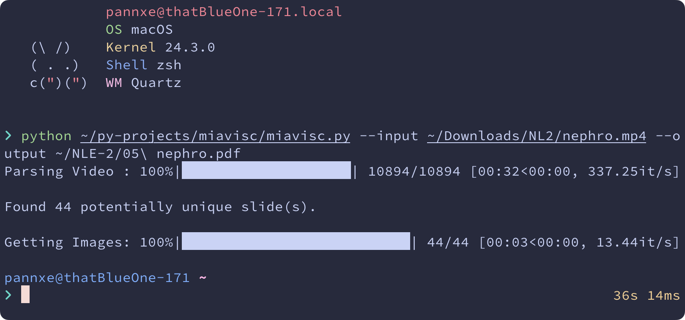

# Miavisc is a Video → Slide Converter

Born out of my frustration, this tool will convert video of a lecture to pdf file at a **blazzingly fast** 🚀 speed. 

Key features includes:

- [x] **Tunable similarity threshold** — so slightly different frame due to mouse movement / lazer pointers are not treated as different page
- [x] **Selectable ignored area** — only process centre portion area (to ignore camera, etc.)

This project is inspired by 

To any professors out there, for the love of capybara and all is that holy in the world, **PLEASE PROVIDE PDF OF YOUR LECTURE VIDEO** 🔥🔥

## Dependencies
- Python 3.10 or newer
- `imagehash`, `av`, `img2pdf`, `imageio`, and `tqdm`

## Brenchmark
Tested with real, 1280x720, .mp4, 02:17:44, 30 FPS lecture video using M2 Macbook Air with 16 GB memmory.

- `--check_per_sec 0 --fast 0` → 30 min. (est.)
- `--check_per_sec 3 --fast 0` → 8 min 55 sec.
- `--check_per_sec 1 --fast 0` → 7 min 23 sec. (est.)

With `--fast 1` various hacks are used to speed thing up. Note the 5.2-10.5x difference.
- `--check_per_sec 0 --fast 1` → 3 min 52 sec.
- `--check_per_sec 3 --fast 1` → 1 min 43 sec. (default)
- `--check_per_sec 1 --fast 1` → 1 min 36 sec.

All files are acceptable in accuracy. And the option of `--fast 0` is made just in case speed hacks affect the final file. 

## Author
- [pannxe](https://github.com/pannxe) — Original author