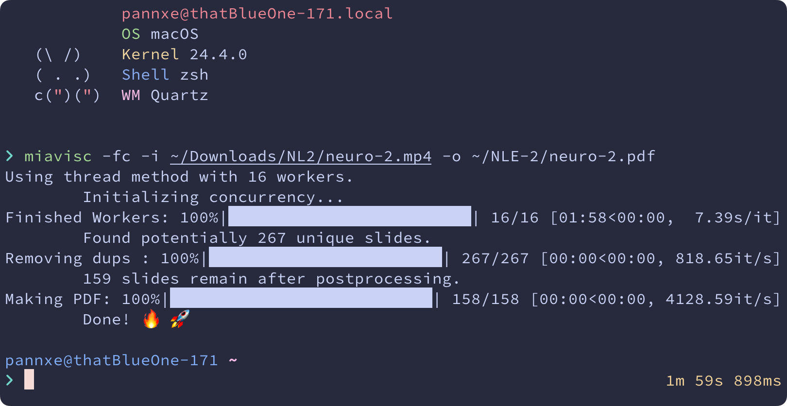

# Miavisc is a Video → Slide Converter



Born out of my frustration, this tool will convert video of a lecture to pdf file at a **blazzingly fast speed** 🚀 (sarcasm intended).

Key features includes:

- [x] **Blezzingly fast 🚀** — compare to other similar programs[^3], Miavisc is **3x faster**[^4] while producing comparable result[^5].
- [x] **Tunable similarity threshold** — so slightly different frame due to mouse movement / lazer pointers are not treated as different page
- [x] **Selectable ignored area** — only process centre portion area (to ignore camera, etc.)

[^3]: That I have tried (e.g., those in reference section).
[^4]: Miavisc at 7:20 min. vs [binh234/video2slides](https://github.com/binh234/video2slides) at 22:08 min. Tested on Macbook Air M2, 512 GB SSD, 16 GM memory using 1280x720 @ 60fps, mp4, 1:11 hr lecture. With GMG algorithm, no skip frames.
[^5]: Overall, results from both programs are very usable without any significant difference (extra or missing slides here and there). Both requires some further manual processing (e.g., delete residual duplications). Note that this evaluation is **SUBJECTIVE** to the creator of this program and thus should be taken with a grain of salt.

This project is inspired by [binh234/video2slides](https://github.com/binh234/video2slides) and a lot of reference are taken from this work.

To any professors out there, for the love of capybara and all is that holy in the world, **PLEASE PROVIDE PDF OF YOUR LECTURE VIDEO** 🔥🔥

## Dependencies

**Python 3.10** or newer

```
pip install opencv-contrib-python imagehash av img2pdf imageio tqdm
```

## Usage

It is recommend that you use `--fast` almost **without exception**.

If you want to speed thing up even more, add `--knn --check_per_sec 10` should not change the final result significantly.

### Windows

```
# Default
py ./miavisc.py --fast --input <PATH_TO_VIDEO> --output <PATH_TO_PDF>
```

```
# Extra fast
py ./miavisc.py --fast --knn --check_per_sec 10 --input <PATH_TO_VIDEO> --output <PATH_TO_PDF>
```

### macOS, Linux, and \*nix

```
# Default
python3 ./miavisc.py --fast --input <PATH_TO_VIDEO> --output <PATH_TO_PDF>
```

```
# Extra fast
python3 ./miavisc.py --fast --knn --check_per_sec 10 --input <PATH_TO_VIDEO> --output <PATH_TO_PDF>
```

## Brenchmark

Tested on Macbook Air M2, 512 GB SSD, 16 GM memory using 1280x720 @ 60fps, mp4, 1:30 hr lecture.

As `--check_per_sec` goes up, risk of page-loss increases but false triggers also decreases. Sweet spot seem to be around 10.

Using GMG algorithm might give you somewhat better result but KKN is faster especially with large `--check_per_sec`.

### Using GMG Algorithm

| Options                     | Execution time | Diff          |
| --------------------------- | -------------- | ------------- |
| `--fast --check_per_sec 0`  | 7:57 min       | Base          |
| `--fast --check_per_sec 10` | 4:04 min       | `-48.8%`      |
| `--fast --check_per_sec 5`  | 2:04 min       | `-74.0%`      |
| `--check_per_sec 5`         | 18:40 min      | `+803.2%`[^1] |

[^1]: vs. `--fast --check_per_sec 5`

### Using KNN Algorithm

| Options                            | Execution time | Diff         |
| ---------------------------------- | -------------- | ------------ |
| `--fast --knn --check_per_sec 0`  | 4:21 min       | Base         |
| `--fast --knn --check_per_sec 10` | 2:26 min       | `-44.1%`     |
| `--fast --knn --check_per_sec 5`  | 1:32 min       | `-64.8%`     |
| ` --knn --check_per_sec 5`         | 6:10 min       | `+75.1%`[^2] |

[^2]: vs. `--fast --knn --check_per_sec 5`

---

**Update**: with further optimization, further reduction of execution time was achived, espacially in animation-heavy slides. Tested using 1280x720 @ 60fps, 02:02 hrs, animation-heavy (and word-document scrolling) lecture video:

| Options                           | Before | After  | Diff     |
| --------------------------------- | ------ | ------ | -------- |
| `--fast --knn --check_per_sec 0`  | `7:22` | `6:17` | `-14.7%` |
| `--fast --knn --check_per_sec 10` | `4:46` | `3:44` | `-21.7%` |

## Author

- [pannxe](https://github.com/pannxe) — Original author

## References

- Kunal Dawn. (2023). **Build a Video to Slides Converter Application using the Power of Background Estimation and Frame Differencing in OpenCV**. _LearnOpenCV_. Accessed April 1st, 2025. [Link](https://learnopencv.com/video-to-slides-converter-using-background-subtraction/).
- [binh234/video2slides](https://github.com/binh234/video2slides)
